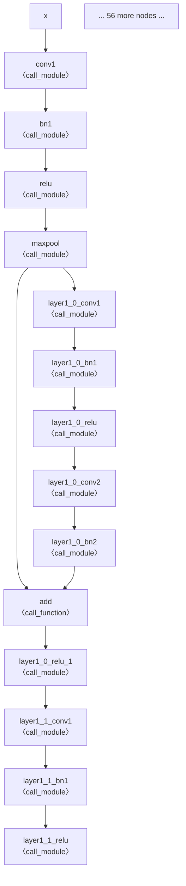
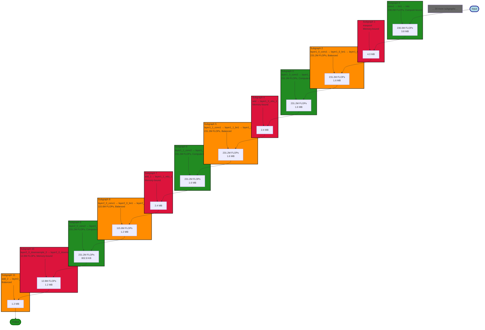
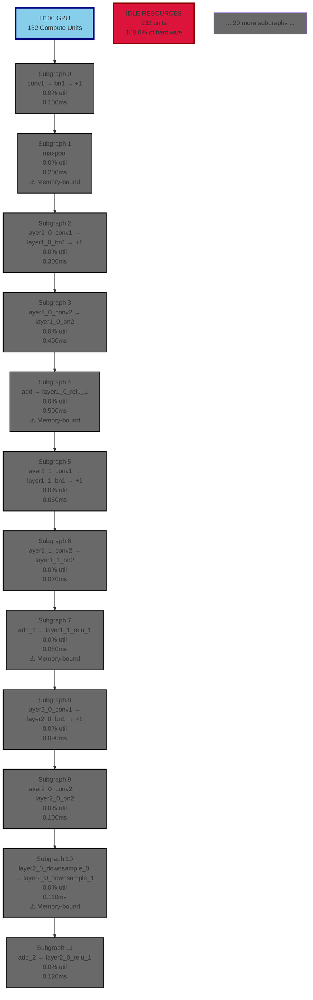

# Mermaid Visualization Demo: ResNet18

This document demonstrates the Mermaid visualization capabilities (Phases 1-3).

---

## 1. FX Graph Structure (Phase 1)

Shows the raw PyTorch FX graph structure with operation types.

---

## 2. Partitioned Graph (Phases 1 & 2)

Shows fused subgraphs with bottleneck analysis.

**Legend** (High Contrast Colors):
- 🟢 **Forest Green**: Compute-bound (efficient use of compute resources)
- 🔴 **Crimson Red**: Memory-bound (bottlenecked by memory bandwidth)
- 🟠 **Dark Orange**: Balanced (mixed compute and memory bound)
- ⚫ **Dim Gray**: Unknown or idle

---

## 3. Hardware Mapping: H100 GPU (Phase 3)

Shows how subgraphs map to H100 GPU streaming multiprocessors.

**Legend** (High Contrast Colors):
- 🟢 **Dark Green**: Very high utilization (>80%)
- 🟢 **Forest Green**: High utilization (60-80%)
- 🟠 **Dark Orange**: Medium utilization (40-60%)
- 🟠 **Orange**: Low utilization (20-40%)
- 🔴 **Crimson**: Very low utilization (<20%)
- ⚫ **Dim Gray**: Idle (0%)

---

## 4. Bottleneck Analysis (Phase 2)

Identifies operations that dominate execution time.

```mermaid
graph TD

    Start[Total Latency: 6.63ms]
    style Start fill:#87CEEB,stroke:#000080,stroke-width:3px

    SG0[Subgraph 0<br/>conv1<br/>0.10ms ~ 2%]
    style SG0 fill:#808080,stroke:#000000,stroke-width:1px
    SG1[Subgraph 1<br/>maxpool<br/>0.20ms ~ 3%]
    style SG1 fill:#808080,stroke:#000000,stroke-width:1px
    SG2[Subgraph 2<br/>layer1_0_conv1<br/>0.30ms ~ 5%]
    style SG2 fill:#808080,stroke:#000000,stroke-width:1px
    SG3[Subgraph 3<br/>layer1_0_conv2<br/>0.40ms ~ 6%]
    style SG3 fill:#808080,stroke:#000000,stroke-width:1px
    SG4[Subgraph 4<br/>add<br/>0.50ms ~ 8%]
    style SG4 fill:#808080,stroke:#000000,stroke-width:1px
    SG5[Subgraph 5<br/>layer1_1_conv1<br/>0.06ms ~ 1%]
    style SG5 fill:#808080,stroke:#000000,stroke-width:1px
    SG6[Subgraph 6<br/>layer1_1_conv2<br/>0.07ms ~ 1%]
    style SG6 fill:#808080,stroke:#000000,stroke-width:1px
    SG7[Subgraph 7<br/>add_1<br/>0.08ms ~ 1%]
    style SG7 fill:#808080,stroke:#000000,stroke-width:1px
    SG8[Subgraph 8<br/>layer2_0_conv1<br/>0.09ms ~ 1%]
    style SG8 fill:#808080,stroke:#000000,stroke-width:1px
    SG9[Subgraph 9<br/>layer2_0_conv2<br/>0.10ms ~ 2%]
    style SG9 fill:#808080,stroke:#000000,stroke-width:1px
    SG10[Subgraph 10<br/>layer2_0_downsample_0<br/>0.11ms ~ 2%]
    style SG10 fill:#808080,stroke:#000000,stroke-width:1px
    SG11[Subgraph 11<br/>add_2<br/>0.12ms ~ 2%]
    style SG11 fill:#808080,stroke:#000000,stroke-width:1px
    SG12[Subgraph 12<br/>layer2_1_conv1<br/>0.13ms ~ 2%]
    style SG12 fill:#808080,stroke:#000000,stroke-width:1px
    SG13[Subgraph 13<br/>layer2_1_conv2<br/>0.14ms ~ 2%]
    style SG13 fill:#808080,stroke:#000000,stroke-width:1px
    SG14[Subgraph 14<br/>add_3<br/>0.15ms ~ 2%]
    style SG14 fill:#808080,stroke:#000000,stroke-width:1px

    Start --> SG0
    SG0 --> SG1
    SG1 --> SG2
    SG2 --> SG3
    SG3 --> SG4
    SG4 --> SG5
    SG5 --> SG6
    SG6 --> SG7
    SG7 --> SG8
    SG8 --> SG9
    SG9 --> SG10
    SG10 --> SG11
    SG11 --> SG12
    SG12 --> SG13
    SG13 --> SG14
```

---

## Summary

This demo shows all visualization types implemented in Phases 1-3:

- ✅ **Phase 1**: FX graph and partitioned graph visualization
- ✅ **Phase 2**: Color schemes (bottleneck, utilization, op_type) and legends
- ✅ **Phase 3**: Hardware mapping with resource allocation

**Next Steps**: Test these visualizations with real analysis data from the unified analyzer.
