# Mermaid Graph Visualization: Design Document

## Feasibility Analysis

**✅ HIGHLY FEASIBLE** - This is an excellent approach for several reasons:

### Why Mermaid is Perfect for This

1. **Native Markdown Support**:
   - GitHub automatically renders Mermaid in `.md` files
   - No external dependencies or image generation
   - Version control friendly (text-based)

2. **Vertical Scalability**:
   - `graph TD` (top-down) layout naturally scales to 100+ nodes
   - Subgraphs for fused operations keep it organized
   - Collapsible sections in GitHub UI

3. **Rich Formatting**:
   - Node styling (colors, shapes, borders)
   - Link labels (tensor shapes, data flow)
   - Annotations (FLOPs, memory, latency)
   - Icons and emojis for visual cues

4. **Architecture Comparison**:
   - Side-by-side subgraphs
   - Color coding for resource utilization
   - Execution order visualization

### What We Can Visualize

| Visualization Type | Purpose | Layout |
|-------------------|---------|--------|
| **FX Graph Structure** | Show original computation graph | Vertical (TD) |
| **Partitioned Graph** | Show fused subgraphs | Vertical with subgraphs |
| **Hardware Mapping** | Show resource allocation per arch | Horizontal comparison |
| **Execution Timeline** | Show sequential vs parallel execution | Horizontal timeline |
| **Bottleneck Analysis** | Highlight compute vs memory bound | Colored vertical |
| **Multi-Architecture Comparison** | Side-by-side execution on 2-3 archs | 3-column layout |

---

## Proposed Architecture

### 1. Core Module: `MermaidGenerator`

Location: `src/graphs/visualization/mermaid_generator.py`

```python
class MermaidGenerator:
    """Convert FX graphs and analysis results to Mermaid diagrams."""

    def __init__(self, style: str = 'default'):
        """
        Args:
            style: Visualization style preset
                - 'default': Clean, minimal
                - 'detailed': Show all metadata
                - 'compact': Minimal labels
                - 'colorful': Color-coded by operation type
        """

    def generate_fx_graph(
        self,
        graph_module: fx.GraphModule,
        direction: str = 'TD',  # TD (top-down), LR (left-right)
        max_nodes: int = 100,   # Limit for large graphs
        show_shapes: bool = True,
        show_types: bool = True,
    ) -> str:
        """Generate Mermaid diagram from FX graph."""

    def generate_partitioned_graph(
        self,
        partition_report: PartitionReport,
        direction: str = 'TD',
        color_by: str = 'bottleneck',  # 'bottleneck', 'op_type', 'utilization'
        show_metrics: bool = True,
    ) -> str:
        """Generate Mermaid diagram showing partitioned/fused graph."""

    def generate_hardware_mapping(
        self,
        analysis_result: UnifiedAnalysisResult,
        direction: str = 'TD',
        show_allocation: bool = True,
        show_latency: bool = True,
    ) -> str:
        """Generate Mermaid diagram showing hardware resource mapping."""

    def generate_architecture_comparison(
        self,
        results: List[UnifiedAnalysisResult],  # 2-3 architectures
        layout: str = 'side_by_side',  # 'side_by_side', 'stacked'
        highlight_differences: bool = True,
    ) -> str:
        """Generate side-by-side comparison of 2-3 architectures."""

    def generate_bottleneck_analysis(
        self,
        analysis_result: UnifiedAnalysisResult,
        threshold: float = 0.8,  # Highlight ops using >80% of time
    ) -> str:
        """Generate diagram highlighting bottleneck operations."""
```

### 2. Integration: Enhanced `ReportGenerator`

Location: `src/graphs/reporting/report_generator.py` (extend existing)

```python
class ReportGenerator:
    """Multi-format report generation (text, JSON, CSV, markdown)."""

    def __init__(self):
        self.mermaid = MermaidGenerator()

    def generate_markdown_report(
        self,
        result: UnifiedAnalysisResult,
        include_diagrams: bool = True,
        diagram_types: List[str] = ['partitioned', 'hardware_mapping'],
    ) -> str:
        """
        Generate comprehensive markdown report with Mermaid diagrams.

        Report structure:
        1. Executive summary (text)
        2. Performance metrics table
        3. Mermaid diagram: Partitioned graph
        4. Hardware mapping analysis
        5. Mermaid diagram: Hardware resource allocation
        6. Bottleneck analysis
        7. Mermaid diagram: Bottleneck visualization
        """

    def generate_comparison_markdown(
        self,
        results: List[UnifiedAnalysisResult],  # Multiple architectures
        include_diagrams: bool = True,
    ) -> str:
        """
        Generate architecture comparison report with side-by-side diagrams.
        """
```

### 3. CLI Integration

Update existing tools:

```bash
# Single architecture analysis with diagrams
python cli/analyze_comprehensive_v2.py \
    --model resnet18 \
    --hardware h100 \
    --output report.md \
    --include-diagrams \
    --diagram-types partitioned hardware_mapping bottleneck

# Architecture comparison with side-by-side diagrams
python cli/compare_architectures.py \
    --model resnet18 \
    --architectures CPU GPU TPU \
    --output comparison.md \
    --include-diagrams \
    --layout side_by_side
```

---

## Visualization Examples

### Example 1: Vertical Graph Layout (Single Architecture)

**Use Case**: Understand graph structure and fusion decisions

```mermaid
graph TD
    Start[Input<br/>224×224×3<br/>0.6 MB]

    subgraph SG1["Subgraph 1 ~ Conv+BN+ReLU<br/>3.8M FLOPs, Compute-bound"]
        SG1_spacer[ ]
        SG1_spacer --> N1
        N1[Conv2d<br/>3×3, 64 filters<br/>3.6M FLOPs]
        N1 --> N2
        N2[BatchNorm2d<br/>64 channels<br/>0.1M FLOPs]
        N2 --> N3
        N3[ReLU<br/>0.05M FLOPs]
    end

    subgraph SG2["Subgraph 2 ~ Conv+BN+ReLU<br/>14.5M FLOPs, Memory-bound"]
        SG2_spacer[ ]
        SG2_spacer --> N4
        N4[Conv2d<br/>3×3, 128 filters<br/>14.4M FLOPs]
        N4 --> N5
        N5[BatchNorm2d<br/>128 channels<br/>0.05M FLOPs]
        N5 --> N6
        N6[ReLU<br/>0.02M FLOPs]
    end

    Start --> SG1_spacer
    N3 --> SG2_spacer

    style SG1 fill:#228B22,stroke:#006400,stroke-width:2px
    style SG2 fill:#DC143C,stroke:#8B0000,stroke-width:2px
    style Start fill:#ADD8E6
    style SG1_spacer fill:none,stroke:none
    style SG2_spacer fill:none,stroke:none
```



**Legend**:
- 🟢 Green subgraphs: Compute-bound (good utilization)
- 🔴 Red subgraphs: Memory-bound (bottleneck)
- 🔵 Blue nodes: I/O operations

### Example 2: Hardware Mapping (Single Architecture)

**Use Case**: See how operations map to hardware resources

```mermaid
graph TD
    subgraph Hardware["H100 GPU ~ 132 SMs, 60 TFLOPS"]
        subgraph Allocation1["SMs 0-31 ~ 32 SMs"]
            SG1_Exec[Conv+BN+ReLU<br/>0.1ms latency<br/>85% SM utilization]
        end

        subgraph Allocation2["SMs 0-63 ~ 64 SMs"]
            SG2_Exec[Conv+BN+ReLU<br/>0.15ms latency<br/>42% SM utilization<br/>⚠️ Memory-bound]
        end

        subgraph Idle["SMs 64-131 ~ IDLE"]
            Unused[68 SMs unused<br/>51% of GPU idle]
        end
    end

    SG1_Exec --> SG2_Exec

    style Allocation1 fill:#228B22
    style Allocation2 fill:#DC143C
    style Idle fill:#696969
    style Unused fill:#DC143C
```



**Insights**:
- Shows exactly which SMs are allocated
- Highlights idle resources
- Shows bottlenecks (memory-bound operations)

### Example 3: Architecture Comparison (Side-by-Side)

**Use Case**: Compare how same graph executes on 3 different architectures

```mermaid
graph LR
    subgraph CPU["CPU ~ 60 cores, 2.78 TFLOPS"]
        C_SG1[Conv+BN+ReLU<br/>8 cores<br/>0.5ms<br/>88% util]
        C_SG2[Conv+BN+ReLU<br/>16 cores<br/>0.4ms<br/>82% util]
        C_SG3[Conv+BN+ReLU<br/>24 cores<br/>0.3ms<br/>75% util]

        C_SG1 --> C_SG2 --> C_SG3
    end

    subgraph GPU["H100 GPU ~ 132 SMs, 60 TFLOPS"]
        G_SG1[Conv+BN+ReLU<br/>32 SMs<br/>0.1ms<br/>85% util]
        G_SG2[Conv+BN+ReLU<br/>64 SMs<br/>0.15ms<br/>42% util<br/>⚠️ Memory]
        G_SG3[Conv+BN+ReLU<br/>48 SMs<br/>0.08ms<br/>68% util]

        G_SG1 --> G_SG2 --> G_SG3
    end

    subgraph TPU["TPU-v4 ~ 2 MXUs, 137.5 TFLOPS"]
        T_SG1[Conv+BN+ReLU<br/>1 MXU<br/>0.2ms<br/>12% util<br/>⚠️ Underutilized]
        T_SG2[Conv+BN+ReLU<br/>2 MXUs<br/>0.18ms<br/>8% util<br/>⚠️ Underutilized]
        T_SG3[Conv+BN+ReLU<br/>1 MXU<br/>0.15ms<br/>15% util<br/>⚠️ Underutilized]

        T_SG1 --> T_SG2 --> T_SG3
    end

    style C_SG1 fill:#228B22
    style C_SG2 fill:#228B22
    style C_SG3 fill:#228B22
    style G_SG1 fill:#228B22
    style G_SG2 fill:#DC143C
    style G_SG3 fill:#FF8C00
    style T_SG1 fill:#DC143C
    style T_SG2 fill:#DC143C
    style T_SG3 fill:#DC143C
```



**Legend**:
- 🟢 Green: >80% utilization (efficient)
- 🟡 Yellow: 50-80% utilization (moderate)
- 🔴 Red: <50% utilization (inefficient)

**Insights**:
- CPU achieves consistent 75-88% utilization
- GPU has mixed performance (memory bottleneck on SG2)
- TPU severely underutilized (8-15%) for small model

### Example 4: Bottleneck Timeline

**Use Case**: Identify which operations dominate execution time

```mermaid
graph TD
    Start[Total Latency: 1.14ms]

    SG1[Subgraph 1<br/>Conv 7×7<br/>0.35ms 31%]
    SG2[Subgraph 2<br/>ResBlock 1<br/>0.08ms 7%]
    SG3[Subgraph 3<br/>ResBlock 2<br/>0.12ms 11%]
    SG4[Subgraph 4<br/>ResBlock 3<br/>0.25ms 22%<br/>🔥 BOTTLENECK]
    SG5[Subgraph 5<br/>ResBlock 4<br/>0.18ms 16%]
    SG6[Subgraph 6<br/>FC Layer<br/>0.16ms 14%]

    Start --> SG1 --> SG2 --> SG3 --> SG4 --> SG5 --> SG6

    style SG1 fill:#DC143C
    style SG4 fill:#DC143C,stroke:#8B0000,stroke-width:4px
    style SG5 fill:#FF8C00
    style SG6 fill:#FF8C00
```



**Legend**:
- 🔥 Red (thick border): Critical bottleneck (>20% of total time)
- 🔴 Pink: Significant contributor (>15% of time)
- 🟡 Yellow: Moderate contributor (10-15%)

---

## Mermaid Syntax Strategies

### For Scalability (100+ nodes)

#### Strategy 1: Collapsible Subgraphs


Users can click "Click to expand" to see detailed view in a separate diagram.

#### Strategy 2: Hierarchical Visualization
Generate multiple diagrams at different zoom levels:
1. **Overview**: Show only subgraphs (high-level)
2. **Detailed**: Show individual operations within selected subgraph
3. **Full**: Complete graph (for small models <50 nodes)

### Color Coding Schemes

#### Scheme 1: By Bottleneck Type
```python
COLOR_SCHEME_BOTTLENECK = {
    'compute_bound': '#228B22',    # Forest green
    'memory_bound': '#DC143C',     # Crimson red
    'balanced': '#FF8C00',         # Dark orange
    'idle': '#696969',             # Dim gray
}
```

#### Scheme 2: By Utilization
```python
COLOR_SCHEME_UTILIZATION = {
    'very_high': '#006400',    # Dark green (>80%)
    'high': '#228B22',         # Forest green (60-80%)
    'medium': '#FF8C00',       # Dark orange (40-60%)
    'low': '#FFA500',          # Orange (20-40%)
    'very_low': '#DC143C',     # Crimson red (<20%)
    'idle': '#696969',         # Dim gray (0%)
}
```

#### Scheme 3: By Operation Type
```python
COLOR_SCHEME_OP_TYPE = {
    'conv': '#1E90FF',         # Dodger blue
    'matmul': '#8A2BE2',       # Blue violet
    'activation': '#228B22',   # Forest green
    'normalization': '#DAA520', # Goldenrod
    'pooling': '#FF8C00',      # Dark orange
    'elementwise': '#008B8B',  # Dark cyan
    'default': '#808080',      # Medium gray
}
```

---

## Markdown Report Structure

### Single Architecture Report

```markdown
# ResNet18 on H100 GPU - Analysis Report

## Executive Summary
- **Model**: ResNet-18 (1.8G FLOPs, 55 MB)
- **Hardware**: H100-PCIe-80GB (132 SMs, 60 TFLOPS)
- **Batch Size**: 1
- **Precision**: FP32

### Key Metrics
| Metric | Value | Status |
|--------|-------|--------|
| Latency | 0.43 ms | ✅ Excellent |
| Throughput | 2,318 FPS | ⚠️ Can improve |
| Compute Utilization | 14.1% | ⚠️ Underutilized |
| Memory BW Util | 13.5% | ⚠️ Underutilized |
| Energy/Inference | 48.9 mJ | ✅ Good |

---

## Graph Structure

### Partitioned Graph (68 Fused Subgraphs)

**See working example**: [test_partitioned_bottleneck.md](test_partitioned_bottleneck.md)

**Analysis**:
- 45 compute-bound subgraphs (green)
- 23 memory-bound subgraphs (red)
- Most bottlenecks in ResBlock 3 and 4

---

## Hardware Mapping

### Resource Allocation

**See working example**: [test_hardware_mapping_h100.md](test_hardware_mapping_h100.md)

**Insights**:
- Peak allocation: 64 SMs (48% of GPU)
- Average allocation: 38 SMs (29% of GPU)
- 94 SMs idle on average (71% waste)
- **Recommendation**: Increase batch size to 16-32

---

## Bottleneck Analysis

### Critical Path (Top 5 Slowest Operations)

**See working example**: [test_bottleneck_analysis.md](test_bottleneck_analysis.md)

**Findings**:
1. Subgraph 34 (ResBlock 3, conv3×3): 31% of total latency
2. Subgraph 12 (Initial conv7×7): 22% of total latency
3. Subgraph 56 (ResBlock 4, conv3×3): 18% of total latency
4. Subgraph 67 (FC layer): 12% of total latency
5. Subgraph 23 (ResBlock 2, conv3×3): 9% of total latency

**Total**: Top 5 operations account for 92% of latency

---

## Recommendations

1. **Increase batch size to 16-32**
   - Expected: 2.5× better utilization (14% → 35%)
   - Expected: 4× better throughput (2,318 → 9,260 FPS)

2. **Use mixed precision (FP16)**
   - Expected: 2× memory bandwidth improvement
   - Expected: 1.5-2× throughput improvement

3. **Apply operator fusion**
   - Conv+BN+ReLU can be fused into single kernel
   - Reduces memory traffic by 40%

4. **Consider different hardware for batch size 1**
   - CPU achieves 88.6% utilization (vs GPU's 14.1%)
   - More efficient for low-batch inference
```

### Architecture Comparison Report

```markdown
# ResNet18: CPU vs GPU vs TPU Comparison

## Architecture Overview

| Architecture | Type | Compute Units | Peak TOPS | Memory BW |
|--------------|------|---------------|-----------|-----------|
| Intel Xeon | CPU | 60 cores | 2.78 | 120 GB/s |
| H100 GPU | GPU | 132 SMs | 60.0 | 2000 GB/s |
| TPU-v4 | TPU | 2 MXUs | 137.5 | 1600 GB/s |

---

## Performance Comparison

| Metric | CPU | GPU | TPU | Winner |
|--------|-----|-----|-----|--------|
| Latency | 1.48 ms | **0.43 ms** | 0.57 ms | GPU ⚡ |
| Throughput | 677 FPS | **2,318 FPS** | 1,766 FPS | GPU 🚀 |
| Compute Util | **88.6%** | 14.1% | 4.7% | CPU 🎯 |
| Energy/Inf | 409 mJ | **48.9 mJ** | 62.1 mJ | GPU 🔋 |

---

## Side-by-Side Execution

### How the Same Graph Executes on Different Hardware

**See working example**: [test_architecture_comparison.md](test_architecture_comparison.md)

**Key Observations**:
1. **CPU**: Consistent 75-88% utilization across all layers (well-balanced)
2. **GPU**: Mixed 10-85% utilization (memory bottlenecks in ResBlock 3-4)
3. **TPU**: Consistently low 4-15% utilization (severe underutilization)

---

## Architecture-Specific Insights

### CPU (Intel Xeon, 60 cores)
✅ **Strengths**:
- Excellent utilization (88.6%) - best use of available resources
- Well-balanced compute and memory
- Predictable performance

⚠️ **Weaknesses**:
- Lower absolute throughput (677 FPS vs GPU's 2,318 FPS)
- Higher energy per inference (409 mJ vs GPU's 49 mJ)

**Best For**: Small batch inference where utilization > throughput

### GPU (H100, 132 SMs)
✅ **Strengths**:
- Lowest latency (0.43 ms)
- Highest throughput (2,318 FPS)
- Best energy efficiency (48.9 mJ)

⚠️ **Weaknesses**:
- Poor utilization (14.1%) - 86% of GPU idle
- Memory-bound on larger ResBlocks

**Best For**: Latency-critical applications, scales well with batch size

### TPU (TPU-v4, 2 MXUs)
✅ **Strengths**:
- Massive compute capability (137.5 TFLOPS)
- Energy efficient at scale (with proper utilization)

❌ **Weaknesses**:
- Severely underutilized (4.7%) - 95% of chip idle
- Matrix dimensions don't fit 128×128 systolic arrays
- Sequential execution overhead

**Best For**: Large models (BERT, GPT) with batch sizes 64-256+

---

## Recommendations by Use Case

| Use Case | Recommended | Rationale |
|----------|-------------|-----------|
| Real-time inference (batch 1) | **GPU** | Lowest latency (0.43ms), best energy |
| Batch inference (16-32) | **GPU** | Best throughput scaling (10,000+ FPS) |
| Edge deployment | **KPU** | Lowest power (5.76 mJ) |
| Large model serving | **TPU** | Efficient at scale (batch 64+) |
| Development/debugging | **CPU** | Consistent, predictable behavior |
```

---

## Implementation Phases

### Phase 1: Core Infrastructure (Week 1)
**Goal**: Basic Mermaid generation working

✅ **Deliverables**:
1. `MermaidGenerator` class with core methods
2. FX graph → Mermaid (basic, no styling)
3. Partition report → Mermaid (with subgraphs)
4. Unit tests

**Effort**: ~2-3 days

### Phase 2: Styling & Color Coding (Week 1-2)
**Goal**: Visual clarity through color schemes

✅ **Deliverables**:
1. Color scheme implementations (bottleneck, utilization, op_type)
2. Node styling (shapes, borders, icons)
3. Legend generation
4. Configurable styles

**Effort**: ~1-2 days

### Phase 3: Hardware Mapping Visualization (Week 2)
**Goal**: Show resource allocation and idle hardware

✅ **Deliverables**:
1. Hardware mapping diagrams
2. Resource allocation visualization
3. Idle resource highlighting
4. Execution timeline

**Effort**: ~2-3 days

### Phase 4: Architecture Comparison (Week 2-3)
**Goal**: Side-by-side comparisons

✅ **Deliverables**:
1. Multi-architecture layout
2. Synchronized subgraph alignment
3. Difference highlighting
4. Comparative legends

**Effort**: ~2-3 days

### Phase 5: Integration & CLI (Week 3)
**Goal**: Seamless integration with existing tools

✅ **Deliverables**:
1. Integrate with `ReportGenerator`
2. Add CLI flags to existing tools
3. Markdown report templates
4. Documentation

**Effort**: ~1-2 days

### Phase 6: Scalability & Polish (Week 3-4)
**Goal**: Handle large graphs gracefully

✅ **Deliverables**:
1. Hierarchical visualization (overview/detail/full)
2. Collapsible subgraphs
3. Interactive elements (GitHub-friendly)
4. Performance optimization
5. Examples and tutorials

**Effort**: ~2-3 days

---

## Technical Considerations

### Mermaid Limitations

1. **Size Limits**:
   - GitHub renders diagrams up to ~10KB of Mermaid syntax
   - For larger graphs: Generate multiple diagrams (hierarchical)
   - Solution: Overview + detail views

2. **Layout Control**:
   - Mermaid auto-layouts nodes (limited manual control)
   - Vertical (TD) scales better than horizontal (LR) for large graphs
   - Solution: Use subgraphs to guide layout

3. **Interactivity**:
   - Limited interactivity in GitHub (can't click to expand)
   - Solution: Generate separate diagrams for different zoom levels

### Performance

- Mermaid generation is fast (~0.1-1ms per diagram)
- No image rendering needed (text-based)
- Can generate 100+ diagrams in <1 second

### GitHub Integration

Markdown reports with Mermaid diagrams work perfectly in:
- GitHub repository view (`.md` files)
- GitHub pull request descriptions
- GitHub issues
- GitHub wikis
- Local markdown viewers (VSCode, Typora, etc.)

---

## Example Use Cases

### Use Case 1: Debug Why GPU Utilization is Low
```bash
python cli/analyze_comprehensive_v2.py \
    --model resnet18 \
    --hardware h100 \
    --output analysis.md \
    --include-diagrams \
    --diagram-types hardware_mapping bottleneck
```

**Output**: Markdown report showing:
1. Which SMs are allocated vs idle
2. Which operations are memory-bound (bottlenecks)
3. Recommendations to improve utilization

### Use Case 2: Compare 3 Architectures
```bash
python cli/compare_architectures.py \
    --model resnet50 \
    --architectures CPU GPU TPU \
    --output comparison.md \
    --include-diagrams \
    --layout side_by_side
```

**Output**: Markdown report showing:
1. Side-by-side execution comparison
2. Color-coded utilization differences
3. Architecture-specific bottlenecks

### Use Case 3: Optimize Model for TPU
```bash
python cli/analyze_comprehensive_v2.py \
    --model bert_base \
    --hardware tpu-v4 \
    --output tpu_optimization.md \
    --include-diagrams \
    --diagram-types partitioned hardware_mapping \
    --batch-size 64
```

**Output**: Markdown report showing:
1. Which layers map well to 128×128 MXUs
2. Which layers cause dimension mismatches
3. Fusion opportunities to improve efficiency

---

## Success Metrics

After implementation, we should be able to:

✅ **Generate visualizations for any model**:
- Small models (ResNet18): <50 nodes, single diagram
- Large models (ResNet152): 150+ nodes, hierarchical view

✅ **Compare 2-3 architectures side-by-side**:
- Clear visual differences in resource allocation
- Bottlenecks highlighted in red
- Utilization color-coded

✅ **Identify optimization opportunities**:
- See exactly which operations cause underutilization
- Understand memory vs compute bottlenecks
- Visual proof of fusion benefits

✅ **GitHub-native reports**:
- Render perfectly in GitHub web UI
- No external dependencies
- Version control friendly

---

## Next Steps

1. **Review this design** - Does this meet your vision?
2. **Prioritize diagram types** - Which visualizations are most valuable?
3. **Start implementation** - Begin with Phase 1 (core infrastructure)
4. **Iterate with examples** - Generate sample diagrams for ResNet18/50

**Estimated Timeline**: 2-3 weeks for full implementation

**Recommended Starting Point**: Phase 1 + one example diagram (partitioned graph) to validate the approach before building out all visualization types.

Would you like me to proceed with Phase 1 implementation and create a prototype diagram for ResNet18?
