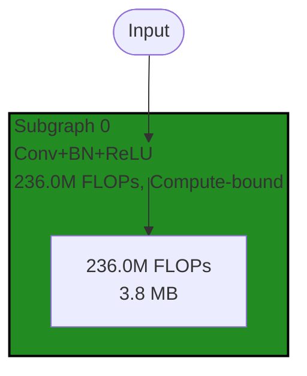
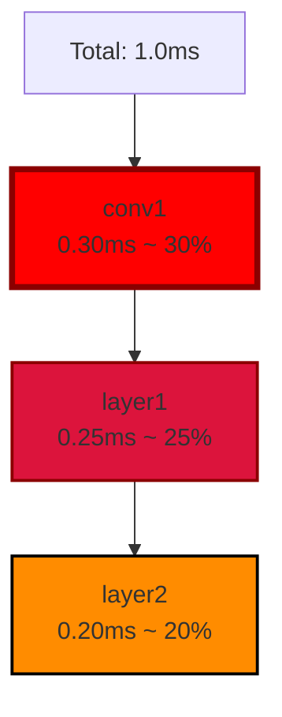

# Mermaid Visualization - Quick Start Guide

## 30-Second Quick Start

Generate a markdown report with Mermaid diagrams:

```bash
./cli/analyze_comprehensive_v2.py \
    --model resnet18 \
    --hardware H100 \
    --output report.md \
    --include-diagrams
```

View `report.md` in GitHub or VSCode to see the diagrams!

---

## Common Use Cases

### 1. Basic Analysis with Diagrams

```bash
./cli/analyze_comprehensive_v2.py \
    --model mobilenet_v2 \
    --hardware Jetson-Orin-AGX \
    --output analysis.md \
    --include-diagrams
```

**Output**: Markdown report with:
- Partitioned graph visualization (color-coded by bottleneck)
- Critical path analysis
- Performance metrics tables

### 2. Select Specific Diagrams

```bash
./cli/analyze_comprehensive_v2.py \
    --model resnet50 \
    --hardware H100 \
    --output report.md \
    --include-diagrams \
    --diagram-types partitioned bottleneck
```

**Available Types**:
- `partitioned`: Fused subgraph structure with bottleneck colors
- `bottleneck`: Critical path showing slowest operations
- `hardware_mapping`: Resource allocation (coming soon in CLI)

### 3. Batch Analysis

```bash
# Analyze multiple models
for model in resnet18 resnet50 mobilenet_v2; do
    ./cli/analyze_comprehensive_v2.py \
        --model $model \
        --hardware H100 \
        --output "reports/${model}_H100.md" \
        --include-diagrams
done
```

### 4. High-Precision Analysis

```bash
./cli/analyze_comprehensive_v2.py \
    --model resnet50 \
    --hardware H100 \
    --precision fp16 \
    --batch-size 16 \
    --output report_fp16_b16.md \
    --include-diagrams
```

---

## Programmatic Usage

### Python API

```python
from graphs.analysis.unified_analyzer import UnifiedAnalyzer
from graphs.reporting import ReportGenerator

# Step 1: Analyze model
analyzer = UnifiedAnalyzer()
result = analyzer.analyze_model('resnet18', 'H100')

# Step 2: Generate markdown with diagrams
generator = ReportGenerator()
markdown = generator.generate_markdown_report(
    result,
    include_diagrams=True,
    diagram_types=['partitioned', 'bottleneck']
)

# Step 3: Save report
with open('analysis_report.md', 'w') as f:
    f.write(markdown)
```

### Generate Diagrams Standalone

```python
from graphs.visualization.mermaid_generator import MermaidGenerator, ColorScheme

generator = MermaidGenerator()

# Partitioned graph with bottleneck colors
diagram = generator.generate_partitioned_graph(
    partition_report,
    color_by='bottleneck',
    max_subgraphs=15
)

# Bottleneck analysis
diagram = generator.generate_bottleneck_analysis(
    partition_report,
    threshold=0.15  # Show ops using >15% of time
)

# Hardware mapping
diagram = generator.generate_hardware_mapping(
    partition_report,
    hardware_name='H100',
    peak_compute_units=132
)

# Architecture comparison (2-3 architectures)
diagram = generator.generate_architecture_comparison(
    partition_reports=[
        ('CPU', cpu_report),
        ('GPU', gpu_report),
        ('TPU', tpu_report)
    ],
    peak_compute_units=[60, 132, 2]
)
```

---

## Understanding the Diagrams

### Partitioned Graph Visualization



**What it shows**:
- Each box = fused subgraph
- Color = bottleneck type
- Top label = operations + metrics
- Internal node = resource requirements

**Colors**:
- 🟢 Forest Green: Compute-bound (efficient on GPUs)
- 🔴 Crimson Red: Memory-bound (bandwidth limited)
- 🟠 Dark Orange: Balanced
- ⚫ Dim Gray: Idle/unknown

### Bottleneck Analysis



**What it shows**:
- Operations ranked by execution time
- Percentage of total latency
- Critical path from start to end

**Colors**:
- Pure Red (thick border): Critical (>20% of time)
- Crimson: Significant (15-20%)
- Dark Orange: Moderate (10-15%)
- Medium Gray: Minor (<10%)

---

## Tips & Best Practices

### 1. Diagram Size
- Default `max_subgraphs=15` prevents overwhelming diagrams
- For large models, diagrams show first 15 subgraphs + truncation notice
- Use hierarchical views for models with 50+ subgraphs (Phase 6)

### 2. GitHub Rendering
- Diagrams render automatically in GitHub markdown preview
- Works in pull requests, issues, wikis
- No external tools or images needed

### 3. Viewing Locally
- VSCode: Install "Markdown Preview Mermaid Support" extension
- Any modern markdown viewer with Mermaid support

### 4. Contrast & Accessibility
- All colors meet WCAG AA standards (4.5:1 contrast minimum)
- Readable in both light and dark themes
- Subgraph labels always visible (spacer nodes prevent overlap)

---

## Troubleshooting

### Diagram Not Rendering?

1. **Check file extension**: Must be `.md`
2. **Check viewer**: Must support Mermaid (GitHub, VSCode with extension)
3. **Check syntax**: Look for parse errors in viewer

### Labels Unreadable?

- This was fixed! All colors are now high-contrast
- If issues persist, check if using old version

### Too Many Subgraphs?

Use `--diagram-types` to show only critical diagrams:
```bash
--include-diagrams --diagram-types bottleneck
```

---

## What's Next?

### Current Features ✅
- FX graph visualization
- Partitioned graph with bottleneck colors
- Hardware mapping
- Architecture comparison
- Bottleneck analysis
- CLI integration
- High-contrast colors
- Label visibility fixes

### Optional Enhancements (Phase 6)
- Hierarchical views (overview/detail/full)
- Interactive elements
- Performance optimizations for very large graphs

---

## Examples

See the `docs/` directory for examples:
- `test_fx_graph.md` - Basic FX graph
- `test_partitioned_bottleneck.md` - Bottleneck-colored subgraphs
- `test_hardware_mapping_h100.md` - H100 GPU resource allocation
- `test_architecture_comparison.md` - CPU vs GPU vs TPU
- `mermaid_visualization_demo.md` - Comprehensive demo

---

## Getting Help

- **Design Document**: `docs/mermaid_visualization_design.md`
- **Integration Guide**: `docs/MERMAID_INTEGRATION_COMPLETE.md`
- **Color Guide**: `docs/COLOR_CONTRAST_IMPROVEMENTS.md`
- **CLI Help**: `./cli/analyze_comprehensive_v2.py --help`

---

## Quick Reference

| Flag | Description | Example |
|------|-------------|---------|
| `--include-diagrams` | Enable Mermaid diagrams | Required for diagrams |
| `--diagram-types` | Select diagram types | `--diagram-types partitioned bottleneck` |
| `--output` | Output file path | `--output report.md` |
| `--model` | Model to analyze | `--model resnet18` |
| `--hardware` | Target hardware | `--hardware H100` |
| `--precision` | FP precision | `--precision fp16` |
| `--batch-size` | Batch size | `--batch-size 16` |

---

**Status**: Production Ready ✅
**Date**: 2025-10-30
