# ResNet18: Bottleneck Analysis

This diagram highlights operations that dominate execution time.

```mermaid
graph TD

    Start[Total Latency: 6.63ms]
    style Start fill:#87CEEB,stroke:#000080,stroke-width:3px

    SG0[Subgraph 0<br/>conv1<br/>0.10ms ~ 2%]
    style SG0 fill:#808080,stroke:#000000,stroke-width:1px
    SG1[Subgraph 1<br/>maxpool<br/>0.20ms ~ 3%]
    style SG1 fill:#808080,stroke:#000000,stroke-width:1px
    SG2[Subgraph 2<br/>layer1_0_conv1<br/>0.30ms ~ 5%]
    style SG2 fill:#808080,stroke:#000000,stroke-width:1px
    SG3[Subgraph 3<br/>layer1_0_conv2<br/>0.40ms ~ 6%]
    style SG3 fill:#808080,stroke:#000000,stroke-width:1px
    SG4[Subgraph 4<br/>add<br/>0.50ms ~ 8%]
    style SG4 fill:#808080,stroke:#000000,stroke-width:1px
    SG5[Subgraph 5<br/>layer1_1_conv1<br/>0.06ms ~ 1%]
    style SG5 fill:#808080,stroke:#000000,stroke-width:1px
    SG6[Subgraph 6<br/>layer1_1_conv2<br/>0.07ms ~ 1%]
    style SG6 fill:#808080,stroke:#000000,stroke-width:1px
    SG7[Subgraph 7<br/>add_1<br/>0.08ms ~ 1%]
    style SG7 fill:#808080,stroke:#000000,stroke-width:1px
    SG8[Subgraph 8<br/>layer2_0_conv1<br/>0.09ms ~ 1%]
    style SG8 fill:#808080,stroke:#000000,stroke-width:1px
    SG9[Subgraph 9<br/>layer2_0_conv2<br/>0.10ms ~ 2%]
    style SG9 fill:#808080,stroke:#000000,stroke-width:1px
    SG10[Subgraph 10<br/>layer2_0_downsample_0<br/>0.11ms ~ 2%]
    style SG10 fill:#808080,stroke:#000000,stroke-width:1px
    SG11[Subgraph 11<br/>add_2<br/>0.12ms ~ 2%]
    style SG11 fill:#808080,stroke:#000000,stroke-width:1px
    SG12[Subgraph 12<br/>layer2_1_conv1<br/>0.13ms ~ 2%]
    style SG12 fill:#808080,stroke:#000000,stroke-width:1px
    SG13[Subgraph 13<br/>layer2_1_conv2<br/>0.14ms ~ 2%]
    style SG13 fill:#808080,stroke:#000000,stroke-width:1px
    SG14[Subgraph 14<br/>add_3<br/>0.15ms ~ 2%]
    style SG14 fill:#808080,stroke:#000000,stroke-width:1px
    SG15[Subgraph 15<br/>layer3_0_conv1<br/>0.16ms ~ 2%]
    style SG15 fill:#808080,stroke:#000000,stroke-width:1px
    SG16[Subgraph 16<br/>layer3_0_conv2<br/>0.17ms ~ 3%]
    style SG16 fill:#808080,stroke:#000000,stroke-width:1px
    SG17[Subgraph 17<br/>layer3_0_downsample_0<br/>0.18ms ~ 3%]
    style SG17 fill:#808080,stroke:#000000,stroke-width:1px
    SG18[Subgraph 18<br/>add_4<br/>0.19ms ~ 3%]
    style SG18 fill:#808080,stroke:#000000,stroke-width:1px
    SG19[Subgraph 19<br/>layer3_1_conv1<br/>0.20ms ~ 3%]
    style SG19 fill:#808080,stroke:#000000,stroke-width:1px

    Start --> SG0
    SG0 --> SG1
    SG1 --> SG2
    SG2 --> SG3
    SG3 --> SG4
    SG4 --> SG5
    SG5 --> SG6
    SG6 --> SG7
    SG7 --> SG8
    SG8 --> SG9
    SG9 --> SG10
    SG10 --> SG11
    SG11 --> SG12
    SG12 --> SG13
    SG13 --> SG14
    SG14 --> SG15
    SG15 --> SG16
    SG16 --> SG17
    SG17 --> SG18
    SG18 --> SG19
```

**Legend**:
- 🔴 Red (thick border): Critical bottleneck (>20% of total time)
- 🔴 Pink: Significant contributor (15-20% of time)
- 🟡 Yellow: Moderate contributor (10-15% of time)
- ⚪ Gray: Minor contributor (<10% of time)

**Optimization Priority**:
Focus optimization efforts on the critical bottleneck operations (red with 🔥).
