# ResNet18: FX Graph Visualization

This diagram shows the first 20 nodes of the ResNet18 FX graph.

```mermaid
graph TD
    N0[x<br/>shape: 〈1, 3, 224, 224〉]
    style N0 fill:#808080
    N1[conv1<br/>〈call_module〉<br/>shape: 〈1, 64, 112, 112〉]
    style N1 fill:#1E90FF
    N2[bn1<br/>〈call_module〉<br/>shape: 〈1, 64, 112, 112〉]
    style N2 fill:#808080
    N3[relu<br/>〈call_module〉<br/>shape: 〈1, 64, 112, 112〉]
    style N3 fill:#228B22
    N4[maxpool<br/>〈call_module〉<br/>shape: 〈1, 64, 56, 56〉]
    style N4 fill:#808080
    N5[layer1_0_conv1<br/>〈call_module〉<br/>shape: 〈1, 64, 56, 56〉]
    style N5 fill:#1E90FF
    N6[layer1_0_bn1<br/>〈call_module〉<br/>shape: 〈1, 64, 56, 56〉]
    style N6 fill:#808080
    N7[layer1_0_relu<br/>〈call_module〉<br/>shape: 〈1, 64, 56, 56〉]
    style N7 fill:#228B22
    N8[layer1_0_conv2<br/>〈call_module〉<br/>shape: 〈1, 64, 56, 56〉]
    style N8 fill:#1E90FF
    N9[layer1_0_bn2<br/>〈call_module〉<br/>shape: 〈1, 64, 56, 56〉]
    style N9 fill:#808080
    N10[add<br/>〈call_function〉<br/>shape: 〈1, 64, 56, 56〉]
    style N10 fill:#008B8B
    N11[layer1_0_relu_1<br/>〈call_module〉<br/>shape: 〈1, 64, 56, 56〉]
    style N11 fill:#228B22
    N12[layer1_1_conv1<br/>〈call_module〉<br/>shape: 〈1, 64, 56, 56〉]
    style N12 fill:#1E90FF
    N13[layer1_1_bn1<br/>〈call_module〉<br/>shape: 〈1, 64, 56, 56〉]
    style N13 fill:#808080
    N14[layer1_1_relu<br/>〈call_module〉<br/>shape: 〈1, 64, 56, 56〉]
    style N14 fill:#228B22
    N15[layer1_1_conv2<br/>〈call_module〉<br/>shape: 〈1, 64, 56, 56〉]
    style N15 fill:#1E90FF
    N16[layer1_1_bn2<br/>〈call_module〉<br/>shape: 〈1, 64, 56, 56〉]
    style N16 fill:#808080
    N17[add_1<br/>〈call_function〉<br/>shape: 〈1, 64, 56, 56〉]
    style N17 fill:#008B8B
    N18[layer1_1_relu_1<br/>〈call_module〉<br/>shape: 〈1, 64, 56, 56〉]
    style N18 fill:#228B22
    N19[layer2_0_conv1<br/>〈call_module〉<br/>shape: 〈1, 128, 28, 28〉]
    style N19 fill:#1E90FF
    Truncated[... 51 more nodes ...]
    N0 --> N1
    N1 --> N2
    N2 --> N3
    N3 --> N4
    N4 --> N5
    N4 --> N10
    N5 --> N6
    N6 --> N7
    N7 --> N8
    N8 --> N9
    N9 --> N10
    N10 --> N11
    N11 --> N12
    N11 --> N17
    N12 --> N13
    N13 --> N14
    N14 --> N15
    N15 --> N16
    N16 --> N17
    N17 --> N18
    N18 --> N19
```

**Legend** (High Contrast Colors):
- 🔵 **Dodger Blue**: Convolution operations
- 🟣 **Blue Violet**: Matrix multiplication / Linear layers
- 🟢 **Forest Green**: Activation functions
- 🟡 **Goldenrod**: Normalization layers
- 🟠 **Dark Orange**: Pooling operations
- 🔷 **Dark Cyan**: Element-wise operations
