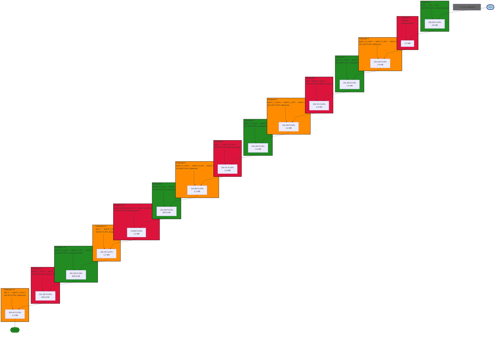

# ResNet18: Partitioned Graph (Bottleneck Analysis)

This diagram shows fused subgraphs colored by bottleneck type.

**Legend** (High Contrast Colors):
- 🟢 **Forest Green**: Compute-bound (efficient use of compute resources)
- 🔴 **Crimson Red**: Memory-bound (bottlenecked by memory bandwidth)
- 🟠 **Dark Orange**: Balanced (mixed compute and memory bound)
- ⚫ **Dim Gray**: Unknown or idle
