# ResNet18: CPU vs GPU vs TPU Comparison

This diagram shows how the same ResNet18 graph executes on 3 different architectures.

```mermaid
graph LR

    subgraph ARCH0["CPU (60 cores) ~ 60 units"]
        ARCH0_SG0[conv1<br/>0%<br/>0.10ms]
        style ARCH0_SG0 fill:#696969
        ARCH0_SG1[maxpool<br/>0%<br/>0.20ms]
        style ARCH0_SG1 fill:#696969
        ARCH0_SG0 --> ARCH0_SG1
        ARCH0_SG2[layer1_0_conv1<br/>0%<br/>0.30ms]
        style ARCH0_SG2 fill:#696969
        ARCH0_SG1 --> ARCH0_SG2
        ARCH0_SG3[layer1_0_conv2<br/>0%<br/>0.40ms]
        style ARCH0_SG3 fill:#696969
        ARCH0_SG2 --> ARCH0_SG3
        ARCH0_SG4[add<br/>0%<br/>0.50ms]
        style ARCH0_SG4 fill:#696969
        ARCH0_SG3 --> ARCH0_SG4
        ARCH0_SG5[layer1_1_conv1<br/>0%<br/>0.06ms]
        style ARCH0_SG5 fill:#696969
        ARCH0_SG4 --> ARCH0_SG5
        ARCH0_SG6[layer1_1_conv2<br/>0%<br/>0.07ms]
        style ARCH0_SG6 fill:#696969
        ARCH0_SG5 --> ARCH0_SG6
        ARCH0_SG7[add_1<br/>0%<br/>0.08ms]
        style ARCH0_SG7 fill:#696969
        ARCH0_SG6 --> ARCH0_SG7
    end

    subgraph ARCH1["H100 GPU (132 SMs) ~ 132 units"]
        ARCH1_SG0[conv1<br/>0%<br/>0.10ms]
        style ARCH1_SG0 fill:#696969
        ARCH1_SG1[maxpool<br/>0%<br/>0.20ms]
        style ARCH1_SG1 fill:#696969
        ARCH1_SG0 --> ARCH1_SG1
        ARCH1_SG2[layer1_0_conv1<br/>0%<br/>0.30ms]
        style ARCH1_SG2 fill:#696969
        ARCH1_SG1 --> ARCH1_SG2
        ARCH1_SG3[layer1_0_conv2<br/>0%<br/>0.40ms]
        style ARCH1_SG3 fill:#696969
        ARCH1_SG2 --> ARCH1_SG3
        ARCH1_SG4[add<br/>0%<br/>0.50ms]
        style ARCH1_SG4 fill:#696969
        ARCH1_SG3 --> ARCH1_SG4
        ARCH1_SG5[layer1_1_conv1<br/>0%<br/>0.06ms]
        style ARCH1_SG5 fill:#696969
        ARCH1_SG4 --> ARCH1_SG5
        ARCH1_SG6[layer1_1_conv2<br/>0%<br/>0.07ms]
        style ARCH1_SG6 fill:#696969
        ARCH1_SG5 --> ARCH1_SG6
        ARCH1_SG7[add_1<br/>0%<br/>0.08ms]
        style ARCH1_SG7 fill:#696969
        ARCH1_SG6 --> ARCH1_SG7
    end

    subgraph ARCH2["TPU-v4 (2 MXUs) ~ 2 units"]
        ARCH2_SG0[conv1<br/>0%<br/>0.10ms]
        style ARCH2_SG0 fill:#696969
        ARCH2_SG1[maxpool<br/>0%<br/>0.20ms]
        style ARCH2_SG1 fill:#696969
        ARCH2_SG0 --> ARCH2_SG1
        ARCH2_SG2[layer1_0_conv1<br/>0%<br/>0.30ms]
        style ARCH2_SG2 fill:#696969
        ARCH2_SG1 --> ARCH2_SG2
        ARCH2_SG3[layer1_0_conv2<br/>0%<br/>0.40ms]
        style ARCH2_SG3 fill:#696969
        ARCH2_SG2 --> ARCH2_SG3
        ARCH2_SG4[add<br/>0%<br/>0.50ms]
        style ARCH2_SG4 fill:#696969
        ARCH2_SG3 --> ARCH2_SG4
        ARCH2_SG5[layer1_1_conv1<br/>0%<br/>0.06ms]
        style ARCH2_SG5 fill:#696969
        ARCH2_SG4 --> ARCH2_SG5
        ARCH2_SG6[layer1_1_conv2<br/>0%<br/>0.07ms]
        style ARCH2_SG6 fill:#696969
        ARCH2_SG5 --> ARCH2_SG6
        ARCH2_SG7[add_1<br/>0%<br/>0.08ms]
        style ARCH2_SG7 fill:#696969
        ARCH2_SG6 --> ARCH2_SG7
    end

```

**Legend** (High Contrast Colors):
- 🟢 **Dark Green**: Very high utilization (>80%)
- 🟢 **Forest Green**: High utilization (60-80%)
- 🟠 **Dark Orange**: Medium utilization (40-60%)
- 🟠 **Orange**: Low utilization (20-40%)
- 🔴 **Crimson**: Very low utilization (<20%)
- ⚫ **Dim Gray**: Idle (0%)

**Key Observations**:
- **CPU**: Moderate utilization (40-60%), well-balanced
- **GPU**: Lower utilization due to massive parallelism not fully used
- **TPU**: Severe underutilization with only 2 large MXUs
