# ResNet18: TPU-v4 Hardware Mapping

This diagram shows how ResNet18 subgraphs map to TPU-v4 resources.

```mermaid
graph TD

    HW[TPU-v4<br/>2 Compute Units]
    style HW fill:#87CEEB,stroke:#000080,stroke-width:4px

    SG0[Subgraph 0<br/>conv1 → bn1 → +1<br/>0.0% util<br/>0.100ms]
    style SG0 fill:#696969,stroke:#000000,stroke-width:2px
    SG1[Subgraph 1<br/>maxpool<br/>0.0% util<br/>0.200ms<br/>⚠️ Memory-bound]
    style SG1 fill:#696969,stroke:#000000,stroke-width:2px
    SG2[Subgraph 2<br/>layer1_0_conv1 → layer1_0_bn1 → +1<br/>0.0% util<br/>0.300ms]
    style SG2 fill:#696969,stroke:#000000,stroke-width:2px
    SG3[Subgraph 3<br/>layer1_0_conv2 → layer1_0_bn2<br/>0.0% util<br/>0.400ms]
    style SG3 fill:#696969,stroke:#000000,stroke-width:2px
    SG4[Subgraph 4<br/>add → layer1_0_relu_1<br/>0.0% util<br/>0.500ms<br/>⚠️ Memory-bound]
    style SG4 fill:#696969,stroke:#000000,stroke-width:2px
    SG5[Subgraph 5<br/>layer1_1_conv1 → layer1_1_bn1 → +1<br/>0.0% util<br/>0.060ms]
    style SG5 fill:#696969,stroke:#000000,stroke-width:2px
    SG6[Subgraph 6<br/>layer1_1_conv2 → layer1_1_bn2<br/>0.0% util<br/>0.070ms]
    style SG6 fill:#696969,stroke:#000000,stroke-width:2px
    SG7[Subgraph 7<br/>add_1 → layer1_1_relu_1<br/>0.0% util<br/>0.080ms<br/>⚠️ Memory-bound]
    style SG7 fill:#696969,stroke:#000000,stroke-width:2px
    SG8[Subgraph 8<br/>layer2_0_conv1 → layer2_0_bn1 → +1<br/>0.0% util<br/>0.090ms]
    style SG8 fill:#696969,stroke:#000000,stroke-width:2px
    SG9[Subgraph 9<br/>layer2_0_conv2 → layer2_0_bn2<br/>0.0% util<br/>0.100ms]
    style SG9 fill:#696969,stroke:#000000,stroke-width:2px
    SG10[Subgraph 10<br/>layer2_0_downsample_0 → layer2_0_downsample_1<br/>0.0% util<br/>0.110ms<br/>⚠️ Memory-bound]
    style SG10 fill:#696969,stroke:#000000,stroke-width:2px
    SG11[Subgraph 11<br/>add_2 → layer2_0_relu_1<br/>0.0% util<br/>0.120ms]
    style SG11 fill:#696969,stroke:#000000,stroke-width:2px
    SG12[Subgraph 12<br/>layer2_1_conv1 → layer2_1_bn1 → +1<br/>0.0% util<br/>0.130ms]
    style SG12 fill:#696969,stroke:#000000,stroke-width:2px
    SG13[Subgraph 13<br/>layer2_1_conv2 → layer2_1_bn2<br/>0.0% util<br/>0.140ms<br/>⚠️ Memory-bound]
    style SG13 fill:#696969,stroke:#000000,stroke-width:2px
    SG14[Subgraph 14<br/>add_3 → layer2_1_relu_1<br/>0.0% util<br/>0.150ms]
    style SG14 fill:#696969,stroke:#000000,stroke-width:2px

    Idle[IDLE RESOURCES<br/>2 units<br/>100.0% of hardware]
    style Idle fill:#DC143C,stroke:#8B0000,stroke-width:3px

    Truncated[... 17 more subgraphs ...]
    style Truncated fill:#696969

    HW --> SG0
    SG0 --> SG1
    SG1 --> SG2
    SG2 --> SG3
    SG3 --> SG4
    SG4 --> SG5
    SG5 --> SG6
    SG6 --> SG7
    SG7 --> SG8
    SG8 --> SG9
    SG9 --> SG10
    SG10 --> SG11
    SG11 --> SG12
    SG12 --> SG13
    SG13 --> SG14
```

**Legend** (High Contrast Colors):
- 🟢 **Dark Green**: Very high utilization (>80%)
- 🟢 **Forest Green**: High utilization (60-80%)
- 🟠 **Dark Orange**: Medium utilization (40-60%)
- 🟠 **Orange**: Low utilization (20-40%)
- 🔴 **Crimson**: Very low utilization (<20%)
- ⚫ **Dim Gray**: Idle (0%)

**Insights**:
- TPU has only 2 MXUs (Matrix Multiplier Units)
- Small model shows severe underutilization
- Most operations can't saturate even 1 MXU
