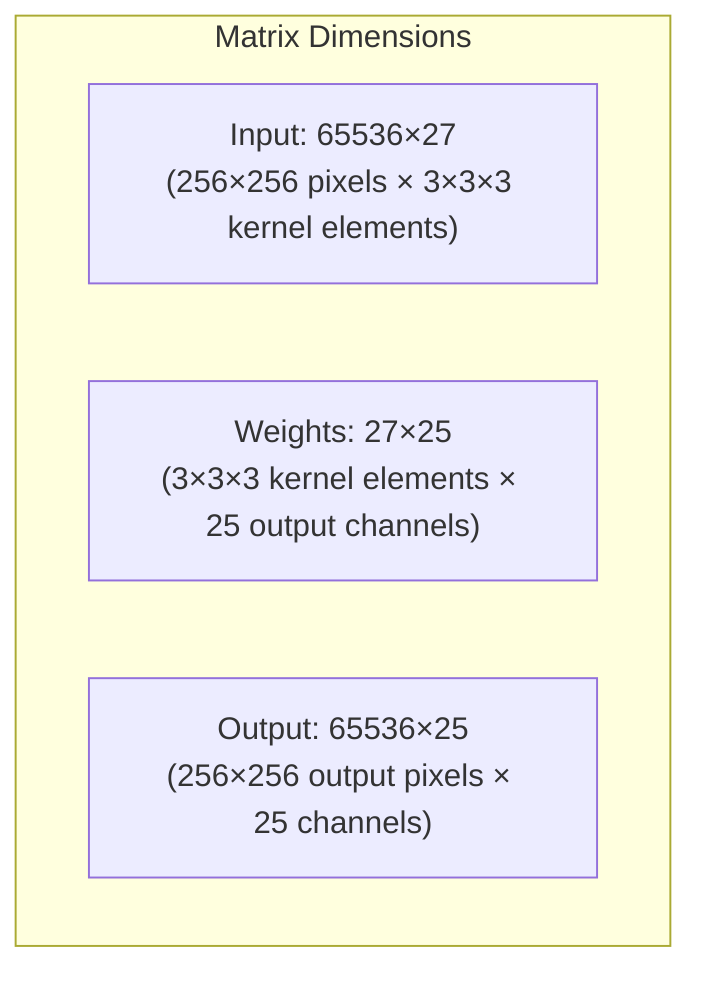

# Convolutional Operator Reshaping

A Conv2D operator using `im2col` to process a 256×256 RGB image (3 channels) with a 3x3 filter kernel across the three color channels to produce 25 output feature channels.

```mermaid
graph TD
    subgraph "Transformation Phase"
        A[Input Feature Map\n256x256x3] --> B[im2col Transformation]
        F[Filter Kernels\n3x3x3x25] --> G[Reshape to Matrix Form]
        B --> C[Unrolled Input\n65536x27 Matrix]
        G --> H[Filter Matrix\n27x25]
    end

    subgraph "Execution on Systolic Array"
        C --> D[Systolic Array\nMatrix Multiplication]
        H --> D
        D --> I[Output Matrix\n65536x25]
    end
  
    subgraph "Reshaping Phase"
        I --> J[Reshape to\n254x254x25 Feature Map]
    end
 ```

```mermaid
graph TD     
    subgraph "Systolic Array Processing"
        K[Systolic Array Core] 
        L[Data Flow Design and Tiling Control] --- K
        
        N[Input Tiles] --> K
        O[Weight Tiles] --> K
        K --> P[Output Accumulation]

        Q[Memory Hierarchy]
        R[On-chip Memory] --- Q
        S[Off-chip Memory] --- Q

        L --- N
        L --- O
        Q --- L
        P --- Q
    end
```



This updated diagram illustrates a realistic Conv2D operation on a Systolic Array:

1. **Input and Filter Dimensions**:
   - Input: 256×256×3 RGB image (786,432 total values)
   - Filters: 25 kernels, each 3×3×3 (for RGB channels) = 675 parameters total

2. **Transformation Process**:
   - The im2col transformation creates a matrix of size 65,536×27
     - 65,536 comes from the output feature map size (254×254) after applying a 3×3 filter
     - 27 comes from flattening each 3×3×3 receptive field (3×3×3=27)
   - Filter kernels are reshaped into a 27×25 matrix
     - 27 parameters per filter, 25 output channels

3. **Systolic Array Execution**:
   - The matrices are too large to fit in the array at once, so tiling is used
   - Input and weight matrices are divided into manageable chunks
   - Processing happens in multiple iterations with results accumulated

4. **Memory Considerations**:
   - A memory hierarchy with on-chip and off-chip memory
   - Data is cached and streamed to maximize compute efficiency
   - Weight-stationary design keeps weights in place while streaming input data

5. **Output**:
   - The result is a 65,536×25 matrix that gets reshaped to 254×254×25
   - The dimensions are 254×254 because applying a 3×3 kernel to a 256×256 image (without padding) reduces the spatial dimensions by 2

This example demonstrates the scale involved in realistic deep learning workloads and why we need to employ sophisticated tiling and memory management strategies to efficiently process these operations.
